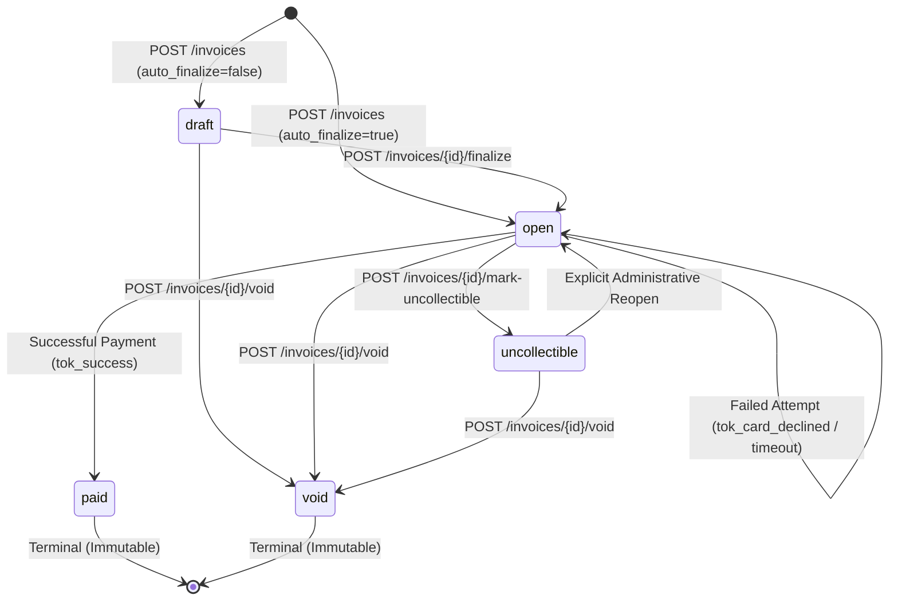

# Technical Design Document: Invoice & Payment Service (DESIGN.md)

**System:** Minimal Invoice & Payment Service  
**Target Platform:** Dodo Payments · Backend Engineering  
**Implementation:** Python 3.10+ / Asynchronous FastAPI / PostgreSQL 16  
**Deliverable Status:** Production-Grade Technical Specification  

---

## 1. Data Model

The data layer is modeled in strict Third Normal Form (3NF) over PostgreSQL 16. It guarantees transactional atomicity, prevents orphaned entities, enforces integer currency arithmetic, and guarantees clean multi-tenant isolation.

```
                  ┌──────────────────────┐
                  │      businesses      │
                  └──────────┬───────────┘
                             │ 1
                             ├─────────────────────────────┬───────────────────────────┐
                             │ N                           │ N                         │ N
                  ┌──────────▼───────────┐      ┌──────────▼───────────┐    ┌──────────▼───────────┐
                  │      customers       │      │       api_keys       │    │  idempotency_records │
                  └──────────┬───────────┘      └──────────────────────┘    └──────────────────────┘
                             │ 1
                             │ N
                  ┌──────────▼───────────┐
                  │       invoices       │
                  └──────────┬───────────┘
                             │ 1
         ┌───────────────────┴───────────────────┐
         │ N                                     │ N
┌────────▼──────────────┐             ┌──────────▼───────────┐
│  invoice_line_items   │             │   payment_attempts   │
└───────────────────────┘             └──────────────────────┘
```

---

### Table Specifications

#### 1. `businesses`
Tenant root representing the registered business issuing invoices.
* **Shape:**
  * `id`: `UUID` NOT NULL PRIMARY KEY DEFAULT `gen_random_uuid()`
  * `name`: `VARCHAR(255)` NOT NULL
  * `created_at`: `TIMESTAMPTZ` NOT NULL DEFAULT `NOW()`
* **Indexes:** Primary key index on `id`.
* **Primary Key Strategy:** Random UUID v4. Prevents account enumeration and allows concurrent distributed creation without centralized auto-increment coordination.
* **Why this shape over alternatives:** Kept deliberately minimal; settings or billing configurations can be added as key-value configurations or extension tables without altering tenant identity.
* **What you would change at 100x scale:** Becomes the primary sharding key for multi-tenant database clusters. All child queries partition on `business_id`.

#### 2. `customers`
Purchasers associated with a business tenant.
* **Shape:**
  * `id`: `UUID` NOT NULL PRIMARY KEY DEFAULT `gen_random_uuid()`
  * `business_id`: `UUID` NOT NULL REFERENCES `businesses(id)` ON DELETE CASCADE
  * `name`: `VARCHAR(255)` NOT NULL
  * `email`: `VARCHAR(255)` NOT NULL
  * `created_at`: `TIMESTAMPTZ` NOT NULL DEFAULT `NOW()`
* **Indexes:**
  * `idx_customers_business`: `(business_id, created_at DESC)`
* **Primary Key Strategy:** UUID v4 for non-guessable client-facing IDs.
* **Why this shape over alternatives:** Enforces tenant isolation (`business_id`). Email is scoped to the tenant, allowing different businesses to invoice the same customer email independently.
* **What you would change at 100x scale:** Add composite unique index `(business_id, email)` if deduplication is required; cache frequently accessed customer records in Redis.

#### 3. `invoices`
Core billing document with formal finite states and integer monetary amounts.
* **Shape:**
  * `id`: `UUID` NOT NULL PRIMARY KEY DEFAULT `gen_random_uuid()`
  * `business_id`: `UUID` NOT NULL REFERENCES `businesses(id)` ON DELETE CASCADE
  * `customer_id`: `UUID` NOT NULL REFERENCES `customers(id)` ON DELETE RESTRICT
  * `state`: `VARCHAR(32)` NOT NULL DEFAULT `'draft'` (Allowed: `draft`, `open`, `paid`, `void`, `uncollectible`)
  * `currency`: `VARCHAR(3)` NOT NULL DEFAULT `'USD'`
  * `total_amount_cents`: `BIGINT` NOT NULL CHECK (`total_amount_cents >= 0`)
  * `due_date`: `DATE` NOT NULL
  * `created_at`: `TIMESTAMPTZ` NOT NULL DEFAULT `NOW()`
  * `updated_at`: `TIMESTAMPTZ` NOT NULL DEFAULT `NOW()`
* **Indexes:**
  * `idx_invoices_business_state`: `(business_id, state)`
  * `idx_invoices_customer`: `(customer_id)`
  * `idx_invoices_due_date`: `(due_date)` WHERE `state = 'open'` (partial index for dunning/past-due scans)
* **Primary Key Strategy:** UUID v4. Client-safe, non-sequential, and secure against ID scraping.
* **Why this shape over alternatives:** 
  * Explicit `state` enum column enforced in code and database constraints.
  * `ON DELETE RESTRICT` on `customer_id` prevents deleting customers with existing financial audit histories.
  * `total_amount_cents` is stored as minor units (`BIGINT`), completely eliminating floating-point rounding errors.
* **What you would change at 100x scale:**
  * Hash or range partition by `business_id` or `created_at`.
  * Move closed/terminal invoices (`paid`, `void` older than 1 year) to cold columnar storage (Parquet/ClickHouse) for analytical reporting.

#### 4. `invoice_line_items`
Individual billable items composing an invoice.
* **Shape:**
  * `id`: `UUID` NOT NULL PRIMARY KEY DEFAULT `gen_random_uuid()`
  * `invoice_id`: `UUID` NOT NULL REFERENCES `invoices(id)` ON DELETE CASCADE
  * `description`: `VARCHAR(255)` NOT NULL
  * `quantity`: `INTEGER` NOT NULL CHECK (`quantity > 0`)
  * `unit_amount_cents`: `BIGINT` NOT NULL CHECK (`unit_amount_cents >= 0`)
  * `total_amount_cents`: `BIGINT` NOT NULL CHECK (`total_amount_cents >= 0`)
* **Indexes:**
  * `idx_line_items_invoice`: `(invoice_id)`
* **Primary Key Strategy:** UUID v4.
* **Why this shape over alternatives:**
  * **Normalized 3NF table vs. JSONB:** Storing line items as a relational table allows database-level check constraints (`quantity > 0`, `unit_amount_cents >= 0`), foreign key integrity, and easy SQL aggregations. Total amounts are computed on the server ($Q \times P$), preventing clients from tampering with line totals.
* **What you would change at 100x scale:**
  * Line items are read and written strictly alongside the parent invoice; in a horizontally sharded setup, `line_items` are co-located with `invoices` on the same database node.

#### 5. `payment_attempts`
Immutable ledger of all payment transactions attempted against an invoice.
* **Shape:**
  * `id`: `UUID` NOT NULL PRIMARY KEY DEFAULT `gen_random_uuid()`
  * `invoice_id`: `UUID` NOT NULL REFERENCES `invoices(id)` ON DELETE RESTRICT
  * `business_id`: `UUID` NOT NULL REFERENCES `businesses(id)` ON DELETE CASCADE
  * `amount_cents`: `BIGINT` NOT NULL CHECK (`amount_cents > 0`)
  * `currency`: `VARCHAR(3)` NOT NULL DEFAULT `'USD'`
  * `status`: `VARCHAR(32)` NOT NULL (Allowed: `pending`, `succeeded`, `failed`)
  * `card_token`: `VARCHAR(128)` NOT NULL
  * `psp_reference`: `VARCHAR(128)` NULL
  * `failure_code`: `VARCHAR(64)` NULL
  * `failure_message`: `TEXT` NULL
  * `idempotency_key`: `VARCHAR(255)` NULL
  * `created_at`: `TIMESTAMPTZ` NOT NULL DEFAULT `NOW()`
* **Indexes:**
  * `idx_payments_invoice`: `(invoice_id, created_at DESC)`
  * `idx_payments_psp_ref`: `(psp_reference)` WHERE `psp_reference IS NOT NULL`
* **Primary Key Strategy:** UUID v4.
* **Why this shape over alternatives:**
  * **Append-Only Ledger:** Payment attempts are never updated destructively (except updating a `pending` attempt to `succeeded` or `failed`). Preserves complete audit history of failed attempts (e.g. card declined) before a successful one.
* **What you would change at 100x scale:**
  * Partition by month (`created_at`) to optimize high-throughput write ingestion.
  * Implement read replicas for merchant reporting dashboards.

#### 6. `idempotency_records`
Atomic transaction cache preventing duplicate execution.
* **Shape:**
  * `id`: `UUID` NOT NULL PRIMARY KEY DEFAULT `gen_random_uuid()`
  * `business_id`: `UUID` NOT NULL REFERENCES `businesses(id)` ON DELETE CASCADE
  * `idempotency_key`: `VARCHAR(255)` NOT NULL
  * `request_path`: `VARCHAR(255)` NOT NULL
  * `request_hash`: `VARCHAR(64)` NOT NULL (SHA-256 of normalized request body)
  * `response_status`: `INTEGER` NOT NULL
  * `response_body`: `JSONB` NOT NULL
  * `created_at`: `TIMESTAMPTZ` NOT NULL DEFAULT `NOW()`
* **Constraints & Indexes:**
  * `UNIQUE (business_id, idempotency_key)`
* **Primary Key Strategy:** UUID v4.
* **Why this shape over alternatives:**
  * Storing `request_hash` detects payload tampering when a key is reused with different parameters.
  * Storing in PostgreSQL (within the transaction) ensures the cached response commit is 100% atomic with the financial mutation.
* **What you would change at 100x scale:**
  * Introduce an automatic TTL eviction policy (e.g. 24-hour expiration) or offload completed records to a high-speed Redis cluster with Redis-Postgres sync.

#### 7. `webhook_endpoints` & `webhook_deliveries`
Configuration and audit log for event dispatching.
* **Shape (`webhook_endpoints`):**
  * `id`: `UUID` NOT NULL PRIMARY KEY DEFAULT `gen_random_uuid()`
  * `business_id`: `UUID` NOT NULL REFERENCES `businesses(id)` ON DELETE CASCADE
  * `url`: `VARCHAR(2048)` NOT NULL
  * `secret`: `VARCHAR(64)` NOT NULL (HMAC signing secret)
  * `is_active`: `BOOLEAN` NOT NULL DEFAULT `TRUE`
  * `created_at`: `TIMESTAMPTZ` NOT NULL DEFAULT `NOW()`
* **Shape (`webhook_deliveries`):**
  * `id`: `UUID` NOT NULL PRIMARY KEY DEFAULT `gen_random_uuid()`
  * `endpoint_id`: `UUID` NOT NULL REFERENCES `webhook_endpoints(id)` ON DELETE CASCADE
  * `event_type`: `VARCHAR(64)` NOT NULL
  * `payload`: `JSONB` NOT NULL
  * `status`: `VARCHAR(32)` NOT NULL (`pending`, `delivered`, `failed`)
  * `attempt_count`: `INTEGER` NOT NULL DEFAULT 0
  * `last_status_code`: `INTEGER` NULL
  * `last_error`: `TEXT` NULL
  * `next_retry_at`: `TIMESTAMPTZ` NULL
  * `created_at`: `TIMESTAMPTZ` NOT NULL DEFAULT `NOW()`
* **Indexes:**
  * `idx_webhook_pending`: `(status, next_retry_at)` WHERE `status = 'pending'`
* **Primary Key Strategy:** UUID v4.
* **Why this shape over alternatives:** Decouples endpoint configuration from delivery logs. Enables retry workers to query only pending tasks efficiently using a partial index.
* **What you would change at 100x scale:** Transition from database-polled delivery to a distributed message broker (Kafka, AWS SQS, or RabbitMQ) feeding dedicated webhook dispatch workers.

---

## 2. Invoice State Machine

The invoice lifecycle is governed by a deterministic Finite State Machine (FSM). States and transitions are strictly codified in `app/state_machine/invoice_state.py`.

### State Diagram



```
               ┌─────────────┐
               │    DRAFT    │
               └──────┬──────┘
                      │
           ┌──────────┴──────────┐
(finalize) │                     │ (void)
           ▼                     ▼
     ┌───────────┐         ┌───────────┐
     │   OPEN    ├────────►│   VOID    │ (Terminal)
     └─────┬─────┘         └───────────┘
           │
           ├─────────────────────┐
 (pay:     │                     │ (mark-uncollectible)
 success)  ▼                     ▼
     ┌───────────┐         ┌───────────┐
     │   PAID    │◄────────┤UNCOLLECT- │ (Reopenable to OPEN)
     │(Terminal) │         │   IBLE    │
     └───────────┘         └───────────┘
```

### Transition Specification Matrix

| Initial State | Event / Action Trigger | Target State | Terminal? | Reversible? | Invariants & Preconditions |
| :--- | :--- | :--- | :--- | :--- | :--- |
| **`[None]`** | `POST /invoices` (`auto_finalize=false`) | `draft` | No | N/A | Total amount $\ge 0$; at least 1 valid line item. |
| **`[None]`** | `POST /invoices` (`auto_finalize=true`) | `open` | No | N/A | Total computed; customer exists. |
| **`draft`** | `POST /invoices/{id}/finalize` | `open` | No | No | Total amount $\ge 0$; freezes line item editing. |
| **`draft`** | `POST /invoices/{id}/void` | `void` | **YES** | **No** | Invoiced in error before issuing. |
| **`open`** | `POST /pay` with `tok_success` | `paid` | **YES** | **No** | Requires payment attempt `status = 'succeeded'`. Locks balance. |
| **`open`** | `POST /pay` with failure/timeout | `open` | No | N/A | Payment attempt logged as `failed`/`pending`; invoice stays payable. |
| **`open`** | `POST /invoices/{id}/void` | `void` | **YES** | **No** | Cancels invoice before payment. |
| **`open`** | `POST /invoices/{id}/mark-uncollectible` | `uncollectible` | No | **Yes** | Invoice is past due or disputed bad debt. |
| **`uncollectible`** | `POST /invoices/{id}/reopen` | `open` | No | **Yes** | Administrative action allowing payment retry. |
| **`uncollectible`** | `POST /invoices/{id}/void` | `void` | **YES** | **No** | Writing off uncollectible debt. |
| **`paid`** | *Any Action* | *N/A* | **YES** | **No** | **Immutable Terminal State.** Any mutation rejected. |
| **`void`** | *Any Action* | *N/A* | **YES** | **No** | **Immutable Terminal State.** Any mutation rejected. |

### Reversible Transitions
* **Only `uncollectible` $\leftrightarrow$ `open` is reversible:** An invoice marked as `uncollectible` can be transitioned back to `open` via an explicit administrative reopen action if the customer arranges payment.
* **`paid` and `void` are strictly irreversible:** Once an invoice enters `paid` or `void`, its state is permanently frozen. No payment, void, finalization, or status update can ever modify it again.

### Rejection of Invalid Transitions
All transitions are validated by `InvoiceStateMachine.transition()` inside an atomic database transaction. If an invalid transition is attempted (e.g. attempting to pay a `void` or `paid` invoice):
1. The transaction is aborted immediately.
2. The endpoint returns **HTTP 409 Conflict** with a structured RFC 7807 error payload:
```json
{
  "error": {
    "code": "INVALID_STATE_TRANSITION",
    "message": "Cannot transition invoice from 'paid' to 'paid'. 'paid' is a terminal state.",
    "current_state": "paid",
    "requested_action": "pay"
  }
}
```

---

## 3. Payment Correctness & Failure Modes

### Failure Scenarios Walkthrough

#### (a) Two clients call `POST /invoices/{id}/pay` for the same invoice at the same instant.
* **Outcome:** Exactly **one** payment succeeds. The second request is rejected with **HTTP 409 Conflict**. The invoice is paid exactly once, and zero double charges occur.
* **Guarantee Mechanism:** **Pessimistic Row-Level Lock (`SELECT ... FOR UPDATE`).**
  1. Transaction 1 and Transaction 2 both begin concurrently.
  2. Transaction 1 executes `SELECT * FROM invoices WHERE id = :id FOR UPDATE`. PostgreSQL grants an exclusive row-level write lock on the invoice row to Transaction 1.
  3. Transaction 2 attempts the same query on the same invoice row and is suspended by the PostgreSQL lock manager, waiting for Transaction 1 to complete.
  4. Transaction 1 verifies `state == 'open'`, dispatches payment to the PSP, receives success, updates `invoices.state = 'paid'`, commits, and releases the lock.
  5. Transaction 2 unblocks and reads the freshly committed invoice row (`state == 'paid'`).
  6. `InvoiceStateMachine.assert_can_pay("paid")` detects the terminal state and immediately raises `InvalidStateTransitionError`, rolling back Transaction 2 and returning HTTP 409 Conflict.

#### (b) The mock PSP times out (`tok_timeout`, 30 s).
* **Endpoint Return:** The service returns **HTTP 504 Gateway Timeout**.
* **State of Invoice and Payment Attempt:**
  * `payment_attempts`: Recorded with status **`pending`**, `failure_code: 'timeout'`, and `failure_message: 'Payment processor timed out after 5.0s'`.
  * `invoices`: **Remains in `open` state.** It is NOT marked as failed or paid.
* **Eventual Result Resolution:** Because the card network or bank may have debited the customer during network latency, marking the attempt as permanently failed would risk double charging if the customer immediately retried. The caller discovers the eventual result through:
  1. **Webhook Notification:** When the PSP's async webhook arrives, the system resolves the attempt to `succeeded` or `failed`.
  2. **Polling:** The client can query `GET /api/v1/invoices/{id}/payment-attempts` to inspect attempt statuses.
  3. **Idempotent Retry:** Retrying with the same `Idempotency-Key` prevents initiating a second card authorization while the first is indeterminate.

#### (c) The PSP returns success but your service crashes before persisting that.
* **What happens on retry:** The client or merchant retries `POST /invoices/{id}/pay` with the original `Idempotency-Key`.
* **Does the customer get charged twice?** **No.**
* **Mechanism:** The service utilizes the client's `Idempotency-Key` (or a deterministic hash of `business_id + invoice_id + attempt_count`) as the idempotency key passed upstream to the PSP.
  * When the service crashes before committing to PostgreSQL, the upstream PSP already has the charge registered under that idempotency key.
  * On retry, the service queries the PSP with that same key. The PSP returns the previously succeeded charge reference instead of authorizing a second charge.
  * The service then commits the `paid` state and returns HTTP 200.

#### (d) An idempotency key is reused with a different request body.
* **What we do:** The service rejects the request immediately with **HTTP 422 Unprocessable Entity** and code `IDEMPOTENCY_CONFLICT`.
* **Mechanism:**
  1. Incoming request body is normalized and hashed: `request_hash = SHA256(canonical_json(body))`.
  2. The service queries `idempotency_records WHERE business_id = :biz_id AND idempotency_key = :key`.
  3. If a record exists and `record.request_hash != request_hash`, the service halts without invoking the PSP or acquiring an invoice lock.

#### (e) An invoice in `paid` state receives another `POST /pay`.
* **What happens:** The endpoint immediately rejects the request with **HTTP 409 Conflict** (`INVALID_STATE_TRANSITION`).
* **Mechanism:** Even if a client supplies a brand-new idempotency key with valid card details, `InvoiceStateMachine.assert_can_pay(invoice.state)` runs immediately after acquiring the row lock. Because `paid` is an immutable terminal state, no further payment attempt is created, the PSP is never called, and the invoice balance is untouched.

---

### Concurrency Mechanism Selection & Alternatives Evaluation

| Concurrency Mechanism | Selected? | Architectural Evaluation | Why Over Alternatives? |
| :--- | :--- | :--- | :--- |
| **Pessimistic Row-Level Lock (`SELECT ... FOR UPDATE`)** | **YES** | Locks the specific invoice row during payment execution. Strictly serializes all concurrent actions for that invoice while allowing concurrent payments for all other invoices. | Guarantees strict linearizability for financial mutations. Simple, native to PostgreSQL, zero race windows. |
| **PostgreSQL Advisory Locks (`pg_advisory_xact_lock`)** | No | Session/transaction locks based on integer hashes. | **Rejected:** Requires hashing string UUIDs into 32/64-bit integers, introducing hash collision risks where unrelated invoices could lock each other. Also incompatible with transaction-mode connection poolers (e.g. PgBouncer). |
| **Optimistic Concurrency Control (`version` column)** | No | Reads row version; updates `WHERE version = :current`. Aborts if version changed. | **Rejected for Payment Path:** In high-concurrency payment retries, optimistic concurrency forces rollbacks after the external PSP call has already completed, leading to external charge completion with local database aborts. |
| **Serializable Isolation Level** | No | PostgreSQL enforces global serializability via SSI locks. | **Rejected:** Introduces non-deterministic serialization failures (`SQLSTATE 40001`) across unrelated queries, requiring complex application-level retry loops. |
| **Status-Conditional Update (`UPDATE ... WHERE state = 'open'`)** | No | Direct atomic update without prior select lock. | **Rejected:** Cannot coordinate the external PSP HTTP call with the database state. If the status is updated to `paid` before calling the PSP, failed charges leave the invoice incorrectly paid; if updated after, duplicate external PSP calls occur. |

---

## 4. Webhook Design

### Cryptographic Signing Scheme (HMAC-SHA256)
All webhook payloads are cryptographically signed to ensure authenticity, payload integrity, and replay-attack defense.

Each HTTP POST to the merchant's endpoint includes:
* `X-Dodo-Signature: t={timestamp},v1={hmac_sha256_hex}`
* `X-Dodo-Event: {event_type}`
* `Content-Type: application/json`

**Signing Algorithm:**
$$\text{signed\_payload} = \text{timestamp} + "." + \text{raw\_json\_body}$$
$$\text{signature} = \text{HMAC-SHA256}(\text{endpoint\_secret}, \text{signed\_payload})$$

**Replay Attack Protection:**
Merchants verify that:
1. $|\text{current\_time} - \text{timestamp}| \le 300\text{ seconds}$ (5-minute tolerance window).
2. The computed HMAC matches `v1` using constant-time string comparison (`hmac.compare_digest`).

---

### Retry Policy & Budget Specification

Deliveries are retried upon receiving non-2xx HTTP status codes (e.g. 500, 502, 503, 504) or network connection timeouts (5.0s client timeout).

| Attempt | Delay / Interval | Cumulative Elapsed Time |
| :---: | :---: | :---: |
| **Attempt 1** | Immediate ($0\text{s}$) | $0\text{s}$ |
| **Attempt 2** | $15\text{s}$ | $15\text{s}$ |
| **Attempt 3** | $30\text{s}$ | $45\text{s}$ |
| **Attempt 4** | $60\text{s}$ | $105\text{s}$ ($1\text{m } 45\text{s}$) |
| **Attempt 5** | $120\text{s}$ | $225\text{s}$ ($3\text{m } 45\text{s}$) |
| **Attempt 6 (Final)** | $240\text{s}$ | **$465\text{s}$ (~$7.75$ minutes total budget)** |

* **Max Attempts:** 5 retries (6 total delivery attempts).
* **Total Time Budget:** Approximately **7.75 minutes**.
* **Jitter:** $\pm 10\%$ randomized jitter added to each interval to prevent thundering-herd synchronicity.

---

### Exhausted Retry Handling & Missed Event Reconciliation
* **Dead-Letter State:** When all 6 attempts fail, the record in `webhook_deliveries` is marked with `status = 'failed'` and an administrative alert is emitted.
* **Merchant Event Reconciliation:**
  1. **Pull-Based Reconciliation:** Merchants query `GET /api/v1/invoices?updated_after={timestamp}` on a cron schedule to reconcile invoice statuses against their local database.
  2. **Manual Replay Endpoint:** Merchants can trigger re-delivery via `POST /api/v1/webhooks/deliveries/{id}/retry`.

---

### Decoupled Delivery Architecture
* **Why Decoupled:** Merchant webhook endpoints are external, unpredictable, and potentially slow or offline. Tying webhook delivery to the API response path would degrade merchant checkout latency from ~150ms to 5+ seconds and cause checkout failures if the merchant's webhook server crashed.
* **How Decoupled:** The API endpoint commits the financial mutation to PostgreSQL and enqueues the delivery in the same transaction. FastAPI background tasks (`asyncio.create_task` / `BackgroundTasks`) execute the HTTP delivery asynchronously after the API response is sent to the client.

---

## 5. API Key Model

### Generation
* Generated using cryptographically secure pseudorandom number generators (`secrets.token_hex(24)`).
* Formatted with identifiable prefixes:
  * Production: `dodo_live_` + 32 hex characters (e.g. `dodo_live_4a1b2c3d4e5f6789...`)
  * Sandbox/Test: `dodo_test_` + 32 hex characters
* Identifiable prefixes enable automated secret scanners (GitHub Secret Scanning, Trufflehog) to detect leaked keys instantly.

### Storage & Hashing
* **Plaintext keys are never stored in the database.**
* When generated, the raw key is displayed to the merchant **once**.
* The database stores:
  * `key_prefix`: First 10 characters (e.g. `dodo_live_`) for identification in logs and UI.
  * `key_hash`: Cryptographic hash `SHA-256(raw_key)`.
  * `is_revoked`: Boolean status flag.

### Transmission
* Sent in the standard HTTP header:
  * `Authorization: Bearer <key>`
  * Or optionally: `X-API-Key: <key>`

### Rotation & Revocation
* **Zero-Downtime Rotation:** A business can hold multiple active API keys simultaneously. Merchants generate a secondary key, update their client services, verify traffic, and then revoke the primary key.
* **Immediate Revocation:** Calling `POST /api/v1/auth/api-keys/{id}/revoke` sets `is_revoked = TRUE` and `revoked_at = NOW()`. Because authentication checks `WHERE is_revoked = FALSE`, revoked keys are invalidated within sub-millisecond database lookups.

### Blast Radius if Leaked
* **Strict Multi-Tenant Containment:** All database queries require `WHERE business_id = :current_business_id`. If an API key is leaked, the attacker's blast radius is strictly limited to that single business's invoices and customers.
* An attacker cannot access other tenants, access system administrative tables, or compromise host infrastructure. Immediate key revocation terminates all unauthorized access instantly.

---

## 6. What You Cut and Why

To prioritize correctness, bulletproof state transitions, and concurrency guarantees, the following features were deliberately excluded:

1. **Subscriptions & Recurring Billing Engine:**
   * *Why Cut:* Subscription billing requires complex schedule daemons, proration engines, grace periods, and dunning cycles. Building a naive scheduler distracts from the core mission: building a bulletproof, atomic invoice payment engine.
   * *Production Approach:* Subscriptions should live in an upstream `Billing Engine` service that generates draft invoices on a schedule and issues them to this service.
2. **Partial Payments, Balance Ledgers & Refunds:**
   * *Why Cut:* Partial payments require multi-attempt balance ledgers and complex reconciliation logic. The spec mandated single-payment invoice settlement.
   * *Production Approach:* Modeled as a double-entry ledger (`credits`, `debits`) where an invoice enters `partially_paid` until the ledger balance matches `total_amount_cents`.
3. **Multi-Currency & Foreign Exchange (FX) Conversion:**
   * *Why Cut:* Handling dynamic FX rates introduces floating-point precision hazards, external oracle dependencies, and currency rounding laws (e.g. zero-decimal currencies like JPY vs. 3-decimal currencies like BHD).
   * *Production Approach:* All financial transactions are strictly enforced in integer minor units of USD (`BIGINT` cents).
4. **Automated Jurisdictional Tax Calculation:**
   * *Why Cut:* Tax rules (US state/county nexus, EU VAT Moss) require third-party calculation engines (TaxJar, Stripe Tax). Hardcoding naive sales tax is inaccurate.
   * *Production Approach:* Taxes are passed in by the caller as explicit, verified line items before finalization.
5. **Complex Dunning & Smart Payment Retries:**
   * *Why Cut:* Automated customer dunning sequences (emailing customers over 30 days, smart card routing across multiple acquirers) belong in an orchestration layer above the transactional payment engine.

---

## 7. Production Readiness Gap

If this microservice were deployed to live production tomorrow, the top 3 missing capabilities are:

### 1. Distributed Observability & Telemetry (OpenTelemetry + Prometheus)
* **Gap:** Currently, the system logs structured text to stdout. Production financial platforms require distributed tracing (OpenTelemetry) with trace propagation across the API, database, and external PSP.
* **Production Implementation:** Export p99 latency metrics, state machine transition counters (`invoices_transition_total{from="open",to="paid"}`), and PSP error rate alerts to Prometheus/Grafana.

### 2. Distributed Rate Limiting & Abuse Prevention
* **Gap:** The service currently processes all valid incoming requests. It lacks rate limiting against brute-force card testing attacks (`tok_card_declined` spamming).
* **Production Implementation:** Implement a Redis-backed sliding-window token bucket algorithm (e.g. 100 req/min per API key; 5 payment attempts per invoice per minute) returning HTTP 429 Too Many Requests.

### 3. Outbox Pattern & Background PSP Reconciliation Daemon
* **Gap:** In scenario 3(b), when a PSP times out after 5 seconds, the attempt is left in `pending`. Currently, resolving this attempt depends on receiving a webhook from the PSP or a customer retry.
* **Production Implementation:** A background cron daemon (`PSPReconciliationWorker`) that queries the PSP's `/charges?idempotency_key=...` endpoint for any attempt stuck in `pending` for $> 5\text{ minutes}$, automatically reconciling indeterminate attempts to `succeeded` or `failed`.
