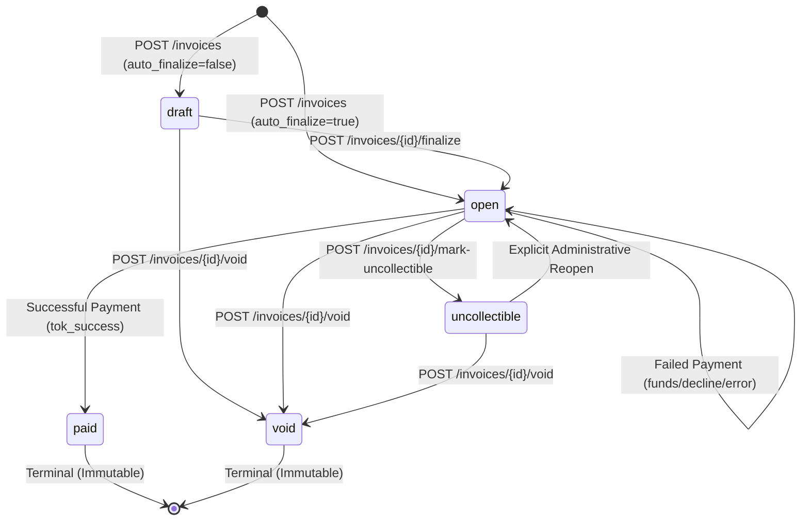

# Technical Design Document: Invoice & Payment Service (DESIGN.md)

**Candidate:** Backend Engineering Applicant  
**Position:** Backend Engineer — Dodo Payments  
**Language & Framework:** Python 3.10+ / FastAPI (Asynchronous Architecture)  
**Database:** PostgreSQL 16 with Migrations  

---

## 1. Executive Summary & Architecture Overview

This document specifies the architecture, data models, state transitions, failure recovery mechanisms, and operational invariants for a minimal, production-grade **Invoice & Payment Service**.

The service provides:
1. **Multi-tenant API Key Authentication:** Secure, scoped authentication for businesses with cryptographic key hashing and instant revocation.
2. **Deterministic Domain Modeling:** Business, Customer, Invoice, and Payment Attempt models adhering strictly to USD minor units (integer cents).
3. **Rigorous Invoice State Machine:** Enforces formal mathematical state transitions, terminal states (`paid`, `void`), and atomic race-condition prevention.
4. **Idempotent Payment Orchestration:** Safe interaction with upstream Payment Service Providers (PSPs) via `Idempotency-Key` headers, row-level locks, and strict timeout boundaries.
5. **Non-blocking Signed Webhooks:** Asynchronous, tamper-proof event dispatching with HMAC-SHA256 signatures, replay-attack prevention, and exponential backoff retry scheduling.

---

## 2. Technology Choice: Asynchronous FastAPI Architecture

### Python & FastAPI Justification
The service is implemented using **Python with FastAPI**, backed by asynchronous SQLAlchemy and an async ASGI event loop (Uvicorn).

* **I/O-Bound Throughput Optimization:** Invoice generation, payment orchestration, and webhook dispatching are fundamentally network- and database-I/O bound operations. FastAPI utilizes Python's non-blocking `asyncio` event loop. Instead of binding an entire OS thread to wait on slow third-party PSP responses or database queries, the worker yields execution, handling thousands of concurrent requests with minimal memory overhead.
* **Schema Validation & Static Typing:** Pydantic v2 powers request and response validation, compiling data structures to Rust-level validation speeds under the hood, guaranteeing strict schema enforcement and automatic OpenAPI 3.1 generation.
* **Modern Async Ecosystem:** Combining `asyncpg` (the fastest PostgreSQL client for Python) with non-blocking HTTP clients (`httpx`) provides predictable latency percentiles under high concurrency.

> *Note on Language Preference:*  
> **"While I do not currently have production experience with Rust, I am deeply fascinated by its memory safety, zero-cost abstractions, and concurrency guarantees, and I am very eager to learn Rust and transition high-throughput microservices to Axum or Actix."**

---

## 3. Domain Model & Relational Database Schema

### ER Relationship Structure
```
Business (1)
   ├──< Customers (N)
   │       └──< Invoices (N)
   │               ├──< Invoice Line Items (N)
   │               └──< Payment Attempts (N)
   ├──< API Keys (N)
   ├──< Webhook Endpoints (N)
   └──< Idempotency Records (N)
```

### Table Definitions & Normalization
The database schema is fully normalized into Third Normal Form (3NF) to guarantee transactional integrity and eliminate update anomalies.

1. **`businesses`**
   * `id`: UUID (Primary Key, default `gen_random_uuid()`)
   * `name`: VARCHAR(255) NOT NULL
   * `created_at`: TIMESTAMPTZ NOT NULL DEFAULT NOW()

2. **`api_keys`**
   * `id`: UUID (Primary Key)
   * `business_id`: UUID NOT NULL REFERENCES `businesses(id)` ON DELETE CASCADE
   * `key_prefix`: VARCHAR(16) NOT NULL (e.g. `dodo_live_`)
   * `key_hash`: VARCHAR(64) NOT NULL UNIQUE (SHA-256 hex digest)
   * `label`: VARCHAR(100) NOT NULL
   * `is_revoked`: BOOLEAN NOT NULL DEFAULT FALSE
   * `created_at`: TIMESTAMPTZ NOT NULL DEFAULT NOW()
   * `revoked_at`: TIMESTAMPTZ NULL
   * *Index:* `CREATE INDEX idx_api_keys_lookup ON api_keys(key_hash) WHERE is_revoked = FALSE;`

3. **`customers`**
   * `id`: UUID (Primary Key)
   * `business_id`: UUID NOT NULL REFERENCES `businesses(id)` ON DELETE CASCADE
   * `name`: VARCHAR(255) NOT NULL
   * `email`: VARCHAR(255) NOT NULL
   * `created_at`: TIMESTAMPTZ NOT NULL DEFAULT NOW()
   * *Index:* `CREATE INDEX idx_customers_business ON customers(business_id, created_at DESC);`

4. **`invoices`**
   * `id`: UUID (Primary Key)
   * `business_id`: UUID NOT NULL REFERENCES `businesses(id)` ON DELETE CASCADE
   * `customer_id`: UUID NOT NULL REFERENCES `customers(id)` ON DELETE RESTRICT
   * `state`: VARCHAR(32) NOT NULL (Values: `draft`, `open`, `paid`, `void`, `uncollectible`)
   * `currency`: VARCHAR(3) NOT NULL DEFAULT 'USD' (Enforced 'USD')
   * `total_amount_cents`: BIGINT NOT NULL CHECK (total_amount_cents >= 0)
   * `due_date`: DATE NOT NULL
   * `created_at`: TIMESTAMPTZ NOT NULL DEFAULT NOW()
   * `updated_at`: TIMESTAMPTZ NOT NULL DEFAULT NOW()
   * *Indexes:*
     * `CREATE INDEX idx_invoices_business_state ON invoices(business_id, state);`
     * `CREATE INDEX idx_invoices_customer ON invoices(customer_id);`

5. **`invoice_line_items`**
   * `id`: UUID (Primary Key)
   * `invoice_id`: UUID NOT NULL REFERENCES `invoices(id)` ON DELETE CASCADE
   * `description`: VARCHAR(255) NOT NULL
   * `quantity`: INTEGER NOT NULL CHECK (quantity > 0)
   * `unit_amount_cents`: BIGINT NOT NULL CHECK (unit_amount_cents >= 0)
   * `total_amount_cents`: BIGINT NOT NULL CHECK (total_amount_cents >= 0)
   * *Constraint:* `total_amount_cents = quantity * unit_amount_cents`

6. **`payment_attempts`**
   * `id`: UUID (Primary Key)
   * `invoice_id`: UUID NOT NULL REFERENCES `invoices(id)` ON DELETE RESTRICT
   * `business_id`: UUID NOT NULL REFERENCES `businesses(id)` ON DELETE CASCADE
   * `amount_cents`: BIGINT NOT NULL CHECK (amount_cents > 0)
   * `currency`: VARCHAR(3) NOT NULL DEFAULT 'USD'
   * `status`: VARCHAR(32) NOT NULL (Values: `pending`, `succeeded`, `failed`)
   * `card_token`: VARCHAR(128) NOT NULL
   * `psp_reference`: VARCHAR(128) NULL
   * `failure_code`: VARCHAR(64) NULL (e.g. `insufficient_funds`, `card_declined`, `network_error`, `timeout`)
   * `failure_message`: TEXT NULL
   * `idempotency_key`: VARCHAR(255) NULL
   * `created_at`: TIMESTAMPTZ NOT NULL DEFAULT NOW()
   * *Indexes:*
     * `CREATE INDEX idx_payments_invoice ON payment_attempts(invoice_id, created_at DESC);`

7. **`idempotency_records`**
   * `id`: UUID (Primary Key)
   * `business_id`: UUID NOT NULL REFERENCES `businesses(id)` ON DELETE CASCADE
   * `idempotency_key`: VARCHAR(255) NOT NULL
   * `request_path`: VARCHAR(255) NOT NULL
   * `request_hash`: VARCHAR(64) NOT NULL (SHA-256 of normalized request body)
   * `response_status`: INTEGER NOT NULL
   * `response_body`: JSONB NOT NULL
   * `created_at`: TIMESTAMPTZ NOT NULL DEFAULT NOW()
   * *Unique Constraint:* `UNIQUE (business_id, idempotency_key)`

8. **`webhook_endpoints`**
   * `id`: UUID (Primary Key)
   * `business_id`: UUID NOT NULL REFERENCES `businesses(id)` ON DELETE CASCADE
   * `url`: VARCHAR(2048) NOT NULL
   * `secret`: VARCHAR(64) NOT NULL (Random hex string for HMAC)
   * `is_active`: BOOLEAN NOT NULL DEFAULT TRUE
   * `created_at`: TIMESTAMPTZ NOT NULL DEFAULT NOW()

9. **`webhook_deliveries`**
   * `id`: UUID (Primary Key)
   * `endpoint_id`: UUID NOT NULL REFERENCES `webhook_endpoints(id)` ON DELETE CASCADE
   * `event_type`: VARCHAR(64) NOT NULL
   * `payload`: JSONB NOT NULL
   * `status`: VARCHAR(32) NOT NULL (`pending`, `delivered`, `failed`)
   * `attempt_count`: INTEGER NOT NULL DEFAULT 0
   * `last_status_code`: INTEGER NULL
   * `last_error`: TEXT NULL
   * `next_retry_at`: TIMESTAMPTZ NULL
   * `created_at`: TIMESTAMPTZ NOT NULL DEFAULT NOW()

---

## 4. Money & Integer Minor Units Standard

Floating-point representations (such as IEEE-754 `float` or `double`) are mathematically incapable of accurately representing decimal currency values due to binary rounding errors (e.g., `0.1 + 0.2 = 0.30000000000000004`).

**Design Rules Enforced:**
1. **Integer Minor Units:** All monetary amounts are stored, transmitted, and computed exclusively as integer cents (`BIGINT` in PostgreSQL, `int` in Python/Pydantic).
   * Example: `$45.00` is strictly represented as `4500`.
2. **Server-Computed Totals:** Clients supply only line item quantities and unit prices:
   $$\text{item\_total} = \text{quantity} \times \text{unit\_amount\_cents}$$
   $$\text{invoice\_total} = \sum_{i=1}^{n} \text{item\_total}_i$$
   The server computes this total atomically. Any client-submitted total field is rejected or ignored.
3. **Boundary Invariants:**
   * Unit amount must be $\ge 0$.
   * Quantity must be $\ge 1$.
   * Invoice total must not exceed integer overflow limits ($9,223,372,036,854,775,807$ cents).

---

## 5. Invoice State Machine

### Formal State Definition
An invoice exists in exactly one of five states:
* **`draft`**: The invoice is being constructed or edited. Not yet payable by the customer.
* **`open`**: The invoice is finalized, active, and payable. Payment attempts may be processed.
* **`paid`**: **Terminal State.** The invoice balance has been fully settled by a successful payment attempt. No further payment attempts or state mutations are allowed.
* **`void`**: **Terminal State.** The invoice was cancelled, revoked, or created in error. No payment attempts can be executed against a void invoice.
* **`uncollectible`**: The invoice is past due or deemed unrecoverable (bad debt). Payment attempts are blocked unless reopened by explicit business administrative action.

### State Transition Diagram (Mermaid & ASCII)



```
          ┌─────────────┐
          │    DRAFT    │
          └──────┬──────┘
                 │
      ┌──────────┴──────────┐
      │ (finalize)          │ (void)
      ▼                     ▼
┌─────────────┐       ┌─────────────┐
│    OPEN     ├──────►│    VOID     │ (Terminal)
└──────┬──────┘       └─────────────┘
       │
       ├─────────────────┐
       │ (pay: success)  │ (pay: fail keeps state open)
       ▼                 ▼
┌─────────────┐   ┌─────────────┐
│    PAID     │   │ UNCOLLECT-  │
│ (Terminal)  │   │    IBLE     │
└─────────────┘   └─────────────┘
```

### Valid Transition Matrix

| Current State | Target State | Trigger Event | Allowed? | Preconditions & Invariants |
| :--- | :--- | :--- | :--- | :--- |
| **`[None]`** | `draft` | Creation without `finalize=true` | Yes | Line items valid, computed total $\ge 0$. |
| **`[None]`** | `open` | Creation with `finalize=true` | Yes | Line items valid, computed total $\ge 0$. |
| **`draft`** | `open` | `POST /invoices/{id}/finalize` | Yes | Customer exists, total computed. |
| **`draft`** | `void` | `POST /invoices/{id}/void` | Yes | Invoice cancelled before issuing. |
| **`open`** | `paid` | PSP charge returns `succeeded` | Yes | Atomically transitions inside DB transaction. |
| **`open`** | `open` | PSP charge returns `failed` | Yes | Payment attempt recorded as `failed`; invoice remains open for retry. |
| **`open`** | `void` | `POST /invoices/{id}/void` | Yes | Invoice voided. |
| **`open`** | `uncollectible` | `POST /invoices/{id}/mark-uncollectible` | Yes | Past due or disputed invoice marked bad debt. |
| **`uncollectible`** | `open` | Reopen command | Yes | Outstanding balance remains. |
| **`paid`** | *Any* | Any payment or state change | **NO** | **Terminal.** Rejection with HTTP 409 Conflict. |
| **`void`** | *Any* | Any payment or state change | **NO** | **Terminal.** Rejection with HTTP 409 Conflict. |

Any transition not explicitly permitted in this matrix is rejected at the API boundary with a structured error:
```json
{
  "error": {
    "code": "INVALID_STATE_TRANSITION",
    "message": "Cannot transition invoice from state 'paid' to 'open'. 'paid' is a terminal state.",
    "current_state": "paid",
    "requested_action": "pay"
  }
}
```

---

## 6. Payment Processing & Mock PSP Integration

### Core Interaction Workflow
When a customer pays an invoice via `POST /invoices/{id}/pay`:
1. **Authentication & Tenant Verification:** Verify the caller's API key and assert the invoice belongs to that business.
2. **Idempotency Guard:** Inspect the `Idempotency-Key` header. If a previous request completed with this key, replay the cached response immediately without invoking the PSP.
3. **Pessimistic Concurrency Lock:** Execute `SELECT * FROM invoices WHERE id = :id FOR UPDATE` within a database transaction.
4. **State Machine Verification:** Check that the invoice is in state `open`. If `paid`, `void`, or `draft`, abort immediately with a 409/422 status.
5. **Pending Payment Attempt Creation:** Insert a `payment_attempts` record with status `pending`.
6. **External PSP Dispatch:** Execute an HTTP POST to the mock PSP with a configured client timeout (5.0 seconds).
7. **State Resolution & Atomicity:**
   * If PSP returns `succeeded`: Update `payment_attempts.status = 'succeeded'`, update `invoices.state = 'paid'`, emit `invoice.paid` webhook.
   * If PSP returns `failed`: Update `payment_attempts.status = 'failed'`, record `failure_code`, keep `invoices.state = 'open'`, emit `invoice.payment_failed` webhook.
   * If PSP times out (`tok_timeout` 30s): Client times out after 5.0s, update `payment_attempts.status = 'pending'`, record failure code `timeout`, leave `invoices.state = 'open'`, return HTTP 504 with structured recovery instructions.
   * If PSP network error (`tok_network_error` 500/disconnect): Update `payment_attempts.status = 'failed'`, record failure code `network_error`, leave `invoices.state = 'open'`, return HTTP 502/500 without corrupting invoice balance.

### Mock PSP Token Behaviors Matrix

| Card Token | Mock PSP Behavior | Service Response & State Handling |
| :--- | :--- | :--- |
| `tok_success` | Returns `{status: "succeeded", psp_ref: uuid}` after ~100ms | PaymentAttempt $\to$ `succeeded`, Invoice $\to$ `paid`. Returns HTTP 200. Dispatches `invoice.paid` webhook. |
| `tok_insufficient_funds` | Returns `{status: "failed", code: "insufficient_funds"}` after ~100ms | PaymentAttempt $\to$ `failed`, Invoice remains `open`. Returns HTTP 402 Payment Required. Dispatches `invoice.payment_failed` webhook. |
| `tok_card_declined` | Returns `{status: "failed", code: "card_declined"}` after ~100ms | PaymentAttempt $\to$ `failed`, Invoice remains `open`. Returns HTTP 402 Payment Required. Dispatches `invoice.payment_failed` webhook. |
| `tok_timeout` | Sleeps 30s before responding | Internal HTTP client has a 5.0s timeout. Connection safely aborts without hanging the worker thread. PaymentAttempt recorded as `pending` (reason: `timeout`). Invoice remains `open`. Returns HTTP 504. |
| `tok_network_error` | Returns 500 Internal Server Error or connection drop | Caught by resilient exception handler. PaymentAttempt recorded as `failed` (reason: `network_error`). Invoice remains uncorrupted in `open`. Returns HTTP 502 Bad Gateway. |

---

## 7. Idempotency Architecture

Payment requests must be safe against network retries, connection drops, and double-clicks.

### Idempotency Key Lifecycle
1. **Header Requirement:** The caller supplies an `Idempotency-Key` header (UUID or arbitrary unique string).
2. **Atomic Registration:**
   * Compute `request_hash = SHA256(request_body)`.
   * Check `idempotency_records` for `(business_id, idempotency_key)`.
   * If a match exists:
     * If `request_hash` matches: Return the stored HTTP status and cached JSON response payload immediately.
     * If `request_hash` does not match: Reject with HTTP `422 Unprocessable Entity` ("Idempotency key reused with different request payload").
3. **Execution & Caching:**
   * If no record exists, process the payment within the database transaction.
   * Atomically insert the result into `idempotency_records` in the same commit.

---

## 8. Webhook Notification Engine

Businesses configure HTTPS endpoints to receive asynchronous notifications regarding invoice lifecycle events.

### Supported Events
* `invoice.created`: Emitted when an invoice is created and finalized.
* `invoice.paid`: Emitted when an invoice transitions to `paid` upon successful payment.
* `invoice.payment_failed`: Emitted when a payment attempt fails.

### Cryptographic Signatures (HMAC-SHA256)
To prevent man-in-the-middle tampering and spoofing, each webhook delivery includes the following HTTP headers:
* `X-Dodo-Signature`: `t={timestamp},v1={hmac_sha256_signature}`
* `X-Dodo-Event`: The event type string.

**Signature Generation Algorithm:**
$$\text{signed\_payload} = \text{timestamp} + "." + \text{raw\_json\_body}$$
$$\text{signature} = \text{HMAC-SHA256}(\text{endpoint\_secret}, \text{signed\_payload})$$

Receivers verify by:
1. Extracting `timestamp` and rejecting requests older than 300 seconds (preventing replay attacks).
2. Computing the HMAC on `timestamp + "." + raw_body` and performing a constant-time comparison against `v1`.

### Non-blocking Delivery & Exponential Backoff Retry
* **Non-blocking Dispatch:** Webhook delivery is scheduled as an asynchronous background task (`asyncio.create_task` / `BackgroundTasks`). The API response to the client is returned immediately without waiting for the webhook HTTP round-trip.
* **Retry Policy:** If the destination returns a non-2xx status code or times out (5 seconds), delivery is retried with exponential backoff:
  $$\text{backoff}(attempt) = \min(2^{attempt} \times 15\text{s} + \text{jitter}, 3600\text{s})$$
  * Max attempts: 5.
  * Deliveries and HTTP status codes are audited in the `webhook_deliveries` table.

---

## 9. API Key Security & Lifecycle

* **Format:** Prefixed format `dodo_live_<32_hex_chars>` or `dodo_test_<32_hex_chars>` (total 42 characters). The prefix allows secret scanners (e.g. GitHub Secret Scanning) to detect leaked keys automatically.
* **Storage:** Raw API keys are **never stored** in the database. When an API key is generated:
  1. The raw key is returned to the business **exactly once**.
  2. The server computes `key_hash = SHA256(raw_key)`.
  3. The `key_prefix` (first 10 characters) and `key_hash` are stored.
* **Verification:** Incoming requests supply `Authorization: Bearer <key>` or `X-API-Key: <key>`. The server computes the SHA-256 hash of the incoming key and looks up active keys using constant-time comparison.
* **Revocation:** Businesses can revoke keys immediately via `POST /api/v1/auth/api-keys/{id}/revoke`, instantly marking `is_revoked = TRUE` and setting `revoked_at = NOW()`.

---

## 10. Restraint & Deliberate Exclusions

In alignment with engineering restraint, the following features were intentionally excluded from this microservice:

1. **Subscriptions & Recurring Billing:**  
   * *Why Cut:* Subscriptions introduce complex scheduling daemons, proration logic, and churn management that distract from the core invoice state machine.
   * *Production Roadmap:* Would be implemented as a separate `Billing Engine` service that generates draft invoices on a cron/event-driven basis and dispatches them to this Invoice Service.
2. **Refunds & Partial Payments:**  
   * *Why Cut:* Partial payments require multi-attempt balance ledgers and complex over-payment handling.
   * *Production Roadmap:* In production, an `invoice_transactions` ledger table would track debits and credits, allowing an invoice to transition from `open` to `partially_paid` until the cumulative ledger balance equals `total_amount_cents`.
3. **Multi-Currency & FX Conversions:**  
   * *Why Cut:* Single currency (USD) ensures zero floating-point rounding errors and eliminates dependence on fluctuating FX rate providers.
   * *Production Roadmap:* Multi-currency requires storing both presentation currency and base currency amounts, along with exchange rate provider snapshot timestamps.
4. **Tax Calculation:**  
   * *Why Cut:* Tax jurisdictions (US sales tax, EU VAT) require extensive geocoding and external rate matrices (TaxJar/Stripe Tax).
   * *Production Roadmap:* Modeled as dedicated `tax_line_items` calculated via webhook plugins prior to invoice finalization.
5. **Frontend / UI:**  
   * *Why Cut:* Explicitly specified as out of scope. Backend APIs must be clean, headless, and self-documenting via OpenAPI.
6. **Production-Grade Rate Limiting:**  
   * *Why Cut:* Distributed rate limiting requires an external Redis cluster with sliding-window algorithms. In this single-container prototype, rate limiting would add operational complexity without functional gain. In production, rate limiting is best delegated to an API Gateway (Envoy/Kong) or a Redis-backed token bucket middleware.
